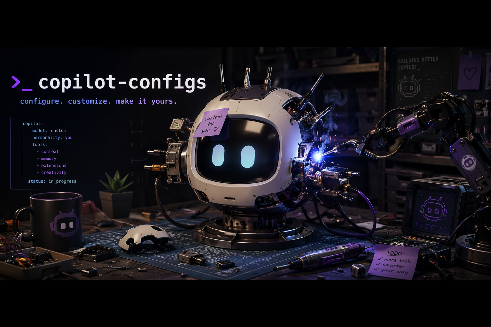

# Copilot Configuration Pack

Reusable GitHub Copilot configuration files that can be copied into new repositories as a starting point for prompts, instructions, agents, and skills.

## What this repository contains

The source of truth lives under `copilot/`. Its contents map directly to `~/.copilot/` and can also be copied into a repository's `.github/` directory.

| Path | Purpose |
| --- | --- |
| `copilot/agents/` | Custom agents for planning, context compression, implementation, review, testing, security, Terraform, and terminal help |
| `copilot/instructions/` | Reusable instruction files scoped by file type or workflow |
| `copilot/prompts/` | Prompt entry points wired to specific agents |
| `copilot/skills/` | Reusable skills for common workflows |
| `copilot/copilot-instructions.md` | Global Copilot instructions |
| `scripts/repo_install.sh` | Installer that copies the pack into a repository |
| `scripts/global_install.sh` | Installer that links the pack into the global user-level Copilot directory used by VS Code and PyCharm |
| `scripts/validate.py` | Validation script for frontmatter, references, and layout |

## Repository layout

```text
copilot/
├── agents/
├── instructions/
├── prompts/
├── skills/
└── copilot-instructions.md
```

## Install into a repository

By default, the repository installer performs a safe merge and does not delete existing files in the target repository.

```bash
bash scripts/repo_install.sh /path/to/repository
```

You can also target a `.github` directory directly:

```bash
bash scripts/repo_install.sh /path/to/repository/.github
```

If you want the target tree to exactly mirror this pack, use prune mode explicitly:

```bash
bash scripts/repo_install.sh --prune /path/to/repository
```

Show help:

```bash
bash scripts/repo_install.sh --help
```

## Install globally

Create user-level symlinks so VS Code and PyCharm use this repository's current Copilot config.

```bash
bash scripts/global_install.sh
```

You can override the base path and force replacement of conflicting paths:

```bash
bash scripts/global_install.sh --copilot-home /custom/copilot/home --force
```

This links:

- `~/.copilot/instructions` -> `copilot/instructions`
- `~/.copilot/agents` -> `copilot/agents`
- `~/.copilot/prompts` -> `copilot/prompts`
- `~/.copilot/skills` -> `copilot/skills`
- `~/.copilot/copilot-instructions.md` -> `copilot/copilot-instructions.md`

Show help:

```bash
bash scripts/global_install.sh --help
```

## Validate this pack

Run the built-in validator before copying changes into other repositories:

```bash
python scripts/validate.py
```

The validator currently checks:

- expected `copilot/` subdirectories exist
- required frontmatter keys exist on agents, instructions, prompts, and skills
- agent handoff `agent` references resolve to real agent names or agent file IDs
- prompt `agent` references resolve to real agent names
- duplicate agent names are not introduced
- symlink artifacts are rejected under `copilot/`
- repository-level `.github/` agents, instructions, and prompts also keep valid frontmatter and internal references

## Maintenance guidance

- Keep `copilot/` as the canonical source tree.
- Do not rely on automatic synchronization between root `.github/` and `copilot/`; root-level files are optional local artifacts.
- Prefer additive installs by default; only use `--prune` when you intend to remove unmanaged target files.
- When adding or changing an agent handoff, validate that its `agent` value matches an agent `name` or agent filename without `.agent.md`.
- When adding a new prompt, validate that its `agent` value exactly matches an agent `name`.
- When adding a new configuration artifact, include complete frontmatter so the validator can enforce consistency.

## Recommended workflow for updates

```bash
python scripts/validate.py
bash scripts/repo_install.sh /tmp/copilot-config-smoke-test
```

Review the copied `.github/` tree in the smoke-test directory before distributing the update more broadly.

## Multi-agent demo runbook

### Safe workflow order

1. Start with plan-approved-slice prompt.
2. Confirm approved slice before deeper planning or implementation.
3. Build a `Context Snapshot`, then generate the detailed implementation plan.
4. Pass compact handoff packets between stages (approved slice, snapshot, delta, gate results) instead of replaying full transcripts.
5. Run `python scripts/validate.py`.
6. Run `bash scripts/repo_install.sh <smoke-test-dir>` without `--prune`.
7. Review installed `.github` tree before broader rollout.

### Acceptance criteria

- [ ] **Pass:** Prompt explicitly uses a plan-approved slice. **Fail:** Prompt is broad or unscoped.
- [ ] **Pass:** Context building happens before detailed implementation planning. **Fail:** Downstream agents re-scan the repo instead of reusing a snapshot.
- [ ] **Pass:** Stage handoffs stay compact and delta-based. **Fail:** Later stages restate full prior outputs without need.
- [ ] **Pass:** Implementation confirms the approved slice before edits. **Fail:** Work starts without scope confirmation.
- [ ] **Pass:** `python scripts/validate.py` exits successfully. **Fail:** Validator reports any error.
- [ ] **Pass:** `bash scripts/repo_install.sh <smoke-test-dir>` runs without `--prune` and completes successfully. **Fail:** Install fails or uses prune mode.
- [ ] **Pass:** Smoke-test `.github` tree is reviewed before wider rollout. **Fail:** No review checkpoint is recorded.

### Rollback note

If changes are not yet committed, use `git restore --staged --worktree README.md` to discard both staged and unstaged edits. If already committed, use `git revert <commit>` to create a safe rollback commit.
